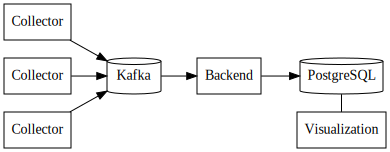

# AvMon - HTTP endpoint availability monitor

A microservice-based HTTP endpoint monitor using [Python](https://python.org/) for the actual code, [Apache Kafka](https://kafka.apache.org/) for combining multi-writer events into a single queue and [PostgreSQL](https://www.postgresql.org/) for long-term data storage.



Project is dockerized using a single container, switched to perform different functions with the `AVMON_ROLE` environment variable. Collector components are configured using a mounted config file.

## Running

A minimal local system (one of each component) can be started with:

```bash
make create-dotenv docker-up
```

or even smaller system without dockerizing the application itself, running all Python services in a single process:

```bash
make create-dotenv install-deps docker-dbs run-all
```

In either case, navigate to https://localhost:8080/ for the visualization.

## Project structure

* `avmon/` - Python packages
    * `collector.py` - Polls the sites and pushes the results to Kafka. Has own config, parallelizes well.
    * `backend.py` - Receives events from Kafka and writes them to a Postgres database.
    * `frontend.py` - Simple visualization frentend
* `tests/` - Integration / E2E tests
* `docker-compose.yml` - Docker-compose-file for running the project normally
* `docker-compose-dbs.yml` - Docker-compose-file for running only the databases in Docker
* `Dockerfile` - Dockerfile to containerize
* `Makefile` - Convenient shortcut commands

## Development

Requireds Python (>= 3.8), and Docker + Docker-compose. Most of the commands are rather \*nix-specific, so Linux or macOS is recommended.

### Setup

```bash
make dev-setup
```

Installs the dev dependencies locally. It also creates git hooks that make sure you will not commit unformatted code or push untested code.

### Formatter

The project uses [Black](https://github.com/psf/black) for code formatting to ensure uniform style. To automatically format code, run `make format`.

### Type checking

[Mypy](http://mypy-lang.org/) is used for type checking. To make sure you have not introduced type errors, run `make type-check`.

### Tests

`make test` runs the whole test suite, which takes quite some time. Use `python -m pytest -k testname` to run one test at a time. `python -m pytest -s` can be used to see test output while the test is still running. Please note that the E2E tests use docker-compose to manage environment and cannot be ran if the system is already running.


## License

MIT